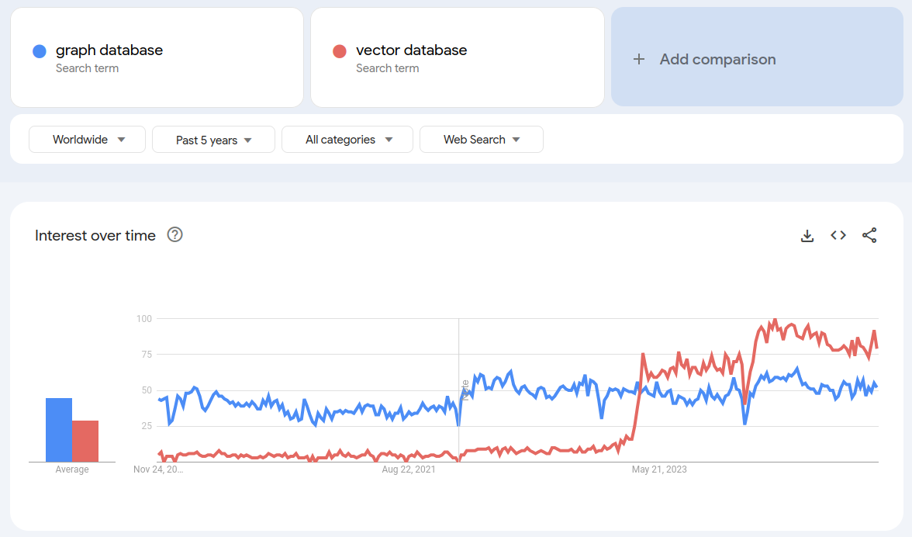
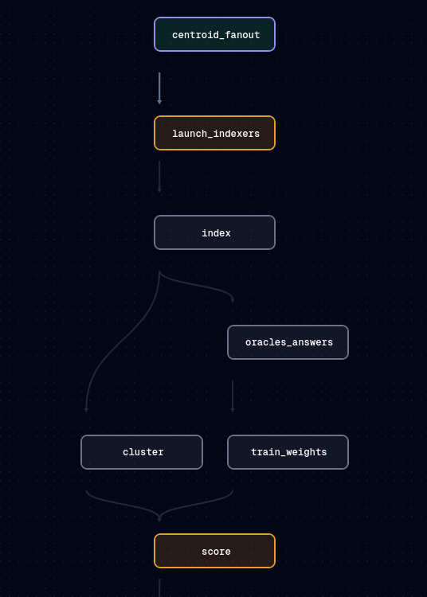

# Externalisation: The Future of Data Management @ Scale

Just as data management has become more pervasive, so has scale become pervasive. Data management is never completely straightforward, but data management at large scales presents us with certain additional unique challenges. Luckily, practitioners have been chipping away at these problems for a while and we have a quite of tools and techniques to help.

In the area of OLAP (OnLine Analytic Processing) this has given rise to a stack of solutions for data pipelining. The Apache stack, which includes Parquet, Arrow, DataFusion among other elements, enables us to use cloud storage to manage our data resources. These objects can be queried as though they were a database, using well trodden query languages such as SQL or more fluent styles directly in code.

On top of this infrastructure are built a host of more elaborated solutions such as Dremio, and DeltaLake. These provide abstraction layers for specific aspects of data management using this stack and general approach.

These sorts of tools allow _Data Lakes_ to be utilised where _Data Warehouses_ might have been previously. Data Lakes are mixed structured and unstructured data assets, either in their initial form, whereas a Data Warehouse are structured data assets which are the result of a data pipeline (usually some sort of extract, transform, load).

The difference between the two becomes somewhat murky with the introduction of data catalogues (such as OpenMetadata, DataHub) for the Data Lakes, and even murkier with the introduction of _Data Lakehouses_ which provide additional guarantees over these assets, such as transactionality or data quality.

In all of these systems, whether to assist in ETL for Data Warehouses, or to enable derived assets in Data Lakes, we can make use of Data Orchaestration tools. Since these pipelines are often large and complex, it's helpful to have a high level _dashboard_ view of the pipelines which can centralise reporting and progress monitoring, as well as ensure reproducability and documentation of process. Popular examples of these tools include Airflow, Dagster and Prefect.

## The Monolith

The data warehouse faces a lot of fundamental problems at scale. Centralisation of data quality and data format requires large central teams and reduces agility. New data assets are hard to encorporate, data quality problems which are noticed by operational teams often take a long time to work into the ETL process, and the shape of data may not be the most useful or natural for those trying to utilise the assets. In short, the centralisation of governance has overheads in time, resources and quality.

In addition, systems which try to give the sorts of data quality and business logic guarantees have a presure to maximise control over resources. For instance, the easiest way to ensure ACID properties (Atomicity Consistency Isolation and Durability) is to have everything live in a single RDBMS (Relational Database Management System).

However, things get even worse with the modern AI enabled stack. Here we will also need documents, vectors and graphs in order to make the most use out of AI techniques. One database to rule them all.

Probably this process of accumulating everything is even feasible for big database players. However, so far, the multimodal offerings in which graph features or vector features are combined in a traditional RDBMS, or vector features combined into a graph, etc. tend to be worse than those offered by the individual specialists. This really should be unsurprising given that they are generally design afterthoughts. We may get one database to rule them all, but it is probably not a very good one.

To make matters worse, at scale we need to distribute workloads. Doing this in a single monolithic database is extremely hard. The _right_ process for creating a large scale vector pipeline that has to distribute over a hundred machines, for instance, may require a lot more flexibility in the data pipeline than a database typically exposes.

Further we may know a lot about the current data pipeline and what guarantees are required and which are not. So much effort has gone into distributed RDBMS technology alone which can help us pretend that we are simply on one computer, but sometimes its better not to pretend and then these abstractions hide important details.

# Breaking the Monolith: Externalisation

Various philosophies have developed to address this problem. Data Mesh, is one notable example, which sees a more distributed data governance approach as being desirable to improve agility and quality. The philosophy aims to put operational teams in charge of maintaining data assets in a way that is exposed to the entire organisation, removing the need for centralisation outside of global guidelines for quality data assets.

We could probably also include the previously mentioned idea of a Data Lakehouses is an attempt to give some of the benefits of centralisation to the more distributed design.

We are coining the term _externalisation_ to talk about the general process of trying to achieve the same sorts of benefits we see from centralisation in something like a RDBMS, Vector DB, or Graph DB, but with these more diffuse data lakes. This is achieved by exposing specific operations, libraries and tools which can give flexibility to the mechanism of discovery, distribution and data orchaestration and which achieves some of the guarantees or simplicity which the monolith provides.

Externalisation is an aspect of Data Mesh, Data Fabrics, Lake Houses and other approaches to big data analytics and processing. It does not encompass these techniques, as it is more on the technical side of things, but it "meshes" as it were, with these philosophies well, essentially because it tries to empower data decentralisation while retaining the positive qualities associated with data centralisation.

## Gaps in Externalisation

The attractiveness of the Data Mesh philosophy derives from the simple fact: the problems of the monolith at scale are real. Yet there are still serious gaps in being able to provide an effective distributed environment which can replace the monolith.

At VectorLink, we have been compiling a list of aspects of the externalised approach that we have encountered which are somewhat awkward in our work. The list of course is not at all exhaustive and some of the gaps may be partially filled but with tools that we find awkward or brittle, or are completely filled but we don't know about it yet (please tell us if they are!). The list is really to give a sort of indication of how we could close the distance so that dataware houses can become less desirable. We will go into detail on each of these subsequently.

- Transactions
- Schema
- Graphs
- Vectors

## Transactions

If you have a straight through pipeline processing some time quanta of work that produces a report at the end, then often times you can just feed everything forward through a series of transformations and that is that.

However, it is often the case that we would like to keep a record perhaps of some entity, in which we want to perform mutations.

This leads us to a problem when more than one process wants to change more than one data resource in a way that is _consistent_. A classic example is a bank account withdraw which is deposited in another bank. If we withdraw the money, we need to be sure that the right amount of money is there, and that if we deposit it in the other account, it no longer remains in the original account for any amount of time at all (lest it be double spent).

RDMBSs are fantastic at maintaining this sort of thing by giving us ACID properties. Every operation feels logically like it is taking place in isolation, so there is no need to worry about how the various operations interact.

However, if we are to externalise this, we need an external transaction manager. And this is not completely untrod ground. Two notable examples are Seata and DTM, both opensource transaction managers used in anger by real systems.

DTM is well thought out and provides several paradigms for transactions including two-phase, try-confirm-cancel, and SAGA among others. Yet, DTM is not looking particularly healthy, the last commit was 6mo ago and it failed some CI/CD health checks.

Seata is looking significantly more healthy with active development, but it is also in the Apache incubator stage. We can expect some maturation to occur.

It should also be pointed out that these external transaction managers often require that local operations are already ACID. This means that there is also a need here for technologies that provide local properties. Here it is worth mentioning Lance, a database technology also built on the DataFusion infrastructure which helps to provide such guarantees by using multiversion concurrency control, but which exists in the datafusion ecosystem as a table provider.

From our survey it seems there is still a fair bit of room for tools with a nice developer experience.

## Schema

Designing data such that it can be reported and manipulated conveniently is a surprisingly difficult problem in practice. With extremely simple examples it is possible to fool oneself into a view of data as a few simple tables with simple joins as being sufficient.

But data which captures important content is really quite complex. All sorts of things can be captured which may have utility.

1. Data atom quality: There is a question of the range of acceptable data which might be difficult to capture in a data type. A phone number is not just a string, a temperature has a meaningful lower limit etc. The data size and storage can be impacted here, the computational time required to process. It can also be understood as a data quality issue, capturing semantically meaningiful data correctly.

2. Provenance: The provenance of information which can often impact analyses later on in that some sources are more trustworthy than others or some sources have intrinsic biases which are simply different.

3. Time: The time associated with data is often more than one thing. Last maintenance of a data is different than the date contained in data, or the date at which something happened. Often times more than one type of date needs to be associated for later analysis. When did a transaction occur? Was the record altered after being retrieved because of some data quality issue and when?

4. Uncertainty: Uncertainty is pervasive in practical data sets. You may also have derived data which makes use of probabilistic methods which require stamping confidence levels on atomic data.

How do we achieve these aims will also keeping our externalised database approach? We've found the tools here to be wanting.

In an ideal world a schema system for externalisation would be a library of data descriptions which one could import and compose much the way programme code is imported and composed. It would be versioned by design, would utilise a package manager, and would allow integration into data pipelines in such a way that it could provide an overlay checking layer, and discovery layer which could inform both humans and code how to process the information in the pipeline and give early warnings when schema definitions were not symmetric with expectations, saving large scale pipeline runs.

## Graphs

The Graph Database world has quite a number of players, but Neo4j now stands as the most well known among them. Another notable example however is TigerGraph which was deigned from the off to scale up, and so is much better for extremely large projects than Neo4j.

But these examples are both monoliths. They have all of the same drawbacks that RDBMSs have, so is there a way to break the graph for parts?

Some of the challenges of graph database relate to the problem of how to shard the data, and how to perform queries after sharding. These problems could actually become easier if they are part of the data pipeline and externalised. Individual shards could potentially be processed separately if certain constraints are known to hold.

The problem of query over graphs can't be easily settled by an automatic procedure which works for all problems. Graph segmentation is a hard problem, and highly connected parts of the graph living on different computational blocks is a nightmare for efficiency. For large scales, it will generally be better to know something about the problem in order to obtain high performance.

But even without sharding, it would be convenient to have graphs coexist naturally with other tabular data in a convenient way. This is possible within an environment such as Apache Datafusion, using a table provider, but it seems there has been little activity in this direction.

Integration would actually not be

Graph databases have not been effectively.

## Vectors

Vector databases have gone from rare to ubiquitous in an extremely short time. And vector databases suffer accutely from the same problems of monolithic design that have the other databases, although in this case with perhaps even less justification.

The value obtained from monolithic design is less likely to be of value for vectors. For semantic indexing and search, taxonomic disovery, clustering, record matching, various RAG (Retrieval Augmented Generation) strategies, and the other aspects which LLMs shine at, transactional behaviour is of lower importance than in, say, a bank account balance.

The data which is fed to vectorisation requires preprocessing to provide effective input. An example is the name field from a database. An LLM can cope very well with a mixed name using title, first name, middle name or initial and surname as a composite, giving a high quality semantic match over a name. Similar things are true of the address, and yet in a database these tend to be stored as separate fields. In addition prompting will also come into play. Often just labelling a field with its semantic content can improve match characteristics. In this way data preparation will involve steps which create composites from templates to produce input to an LLM. And this step wants to be part of a data-pipeline which is hooked into the vectorisation process.

Then there is the problem of balancing vector processing. LLM vectorisation of source data is an [embarassingly parallel](https://en.wikipedia.org/wiki/Embarrassingly_parallel) problem. Yet it is not easy to get a database to control the process of spinning up a fleet of vectorisers. In addition, not spinning up a fleet could be extremely time consuming, even to the point of infeasibility when scales exceed around 100 million.

After vectorisation you have vectors that can be of value in direct comparisons between records even without an index. This comes in handy when trying to produce high quality record matches after you have already obtained candidates. This suggests that the vectors should be easily accessible to other analytics code that can make use of them. So cloud storage is to be prefered over a special purpose database or a database service which holds the vectors.

Creating an index over high dimensional vectors is a difficult prospect and is still a very active field of experimentation. The problem lends strongly towards probabilistic solutions, which are currently dominating the landscape in vector indices. These probabilistic methods tend to sacrifice recall for speed. This is especially true as the scale of vectors increases.

This can be mitigated by various multi-indexing approaches, and many of these involve creating a sharding strategy where we search multiple shards for potential matches. Controlling sharding strategy then becomes very important and something which should fit nicely into ones pipelines.

In the case of _clustering_, that is, attempting to find groups of matching vectors, we have an even more difficult problem. Here sharding can militate against effective clustering unless careful sharding choices are made.

All over these probems with monolithic design are readily and easily solved through a process of externalisation. What we need is less of a vector database and more of a toolkit of vector processing stages treated much the way we treat other data assets and query in our analytic data pipelines.

And yet this role is not filled effectively yet by any of the vector databases we have explored. While it is certainly possible to use vector databases in special purpose ways along the data pipeline, it has the same feel as using a postgres database as a data asset. It is not necessarily a bad idea, but it isn't really playing the role natively.

Currently we are building a data pipeline stack using Dagster, Apache Arrow, Apache Datafusion and some custom tooling to expose vector database indices in a way that will hopefully play nicely in this environment as a proof of concept.

## Conclusion

As we move more and more towards cloud based, big scale and concurrent solutions, we will find ourselves increasingly up against the problems imposed by the monolith. Overcoming the inconveniences and filling the gaps will be both frustrating and fruitful, but it will be necessary for a significant swath of applications. We are looking forward to experimenting with and overcoming some of these problems ourselves and will keep abreast of developments in this area so we can be at the forefront of explorations on data @ scale.
