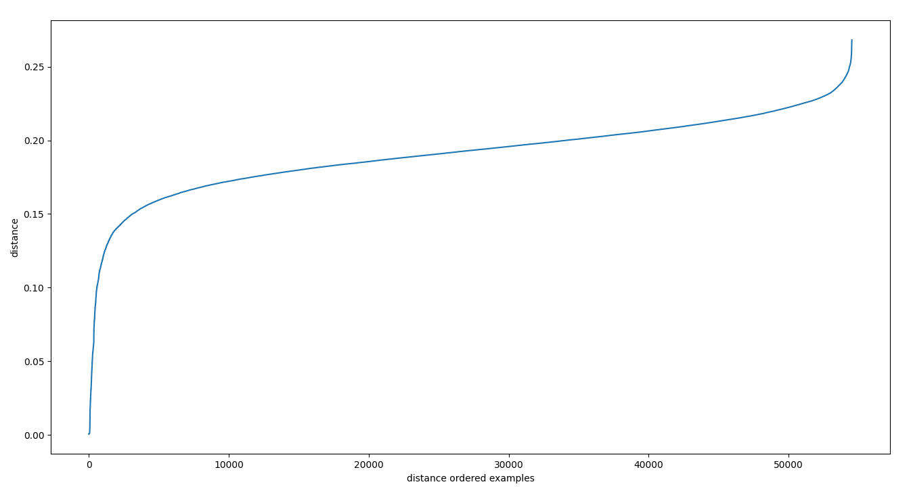
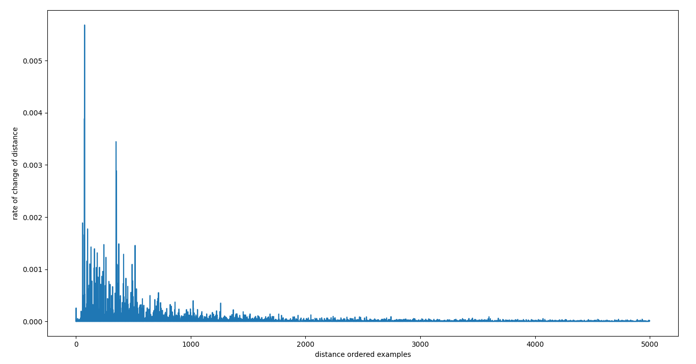

# LLM Classifier Bootstrapping

Machine Learning classifiers can be powerful and efficient tools for classification problems. As we saw in our article on [record matching / entity resolution](./RecordMatch.md) we can learn a logistic function over distances between vectors to create a very accurate and flexible tool for record matching.

These techniques are already leveraging LLM's to create embeddings which capture the semantic content of records. But we can go a step further in applying LLMs to classification problems by removing the need to curate training data for our record match. We call this **LLM Classifier Bootstrapping**, since we will use a sort of active-learning approach, where the feed back comes from an LLM.

The record matching logic that we discussed previously can obtain very high quality results, but it relies on finding the weights for our classifier. To learn these weights we need correct answers, and we use these correct answers to drive our cost-function, which in turn drives our gradient descent. We are left with a problem of obtaining a set of correct answers.

This presents a bit of a problem, as in many real-world use cases, the correct matches are simply not yet known. And creating a curated data set of correct matches is a very time consuming, not to mention error prone task.

In this article we will describe a process that uses an LLM to bootstrap a training data set which we can use to obtain the weights. This approach can completely automate the process of creating a classifier.

## An Outline of the Process

The general outline of the process is thus:

- We create a vectorisation of our JSON or CSV file using templates as described [previously](./RecordMatch.md)
- We index on a discriminating field (also described previously)
- Create a line-index for the input JSON or CSV (we will need random access to the original records)
- Search for a reasonable selection of true and false records so our classifier can be effectively trained
- Annotate correct versus incorrect answers using an LLM

Since the first two steps have been described in our previous article, we'll skip these steps and go into more detail concerning what is happening internally when you run this 'match-generator'.

## Finding Candidates

To find good matching candidates to generate a training set presents a problem in itself. To train a classifier we need to have both positive and negative examples, and though it is not always the case for all use-cases, in record matching it is _almost always_ the case that positive solutions are much less likely than negative solutions. There are just a lot more ways to not be a matching record than to be a matching record.

This means we have to pare the space down from the get go to _candidate_ matches which we can then add to our curated set. The first step here is to choose our discriminating field. This field gives us a single indexed distance measure over a field or aggregate of fields from our records. In our case we choose the aggregate template `record` which includes every field in our template. While this measure is not the best for discriminating match records by itself, it is very good for finding candidates.

This measure alone, however, is insufficient. We want to have a relatively balanced set of positive versus negative examples to feed to our LLM to discriminate. How can we find something that probably matches versus something that probably doesn't match before we know?

As it turns out, distances in our index tend to see large changes when we transition from areas of matches to areas which do not match. There is in essence a sort of _cliff_ which we fall of in distance when we stop matching. With aggregate template measures, those in which we take multiple fields for a single matchin, we will see several of these cliffs corresponding to one of the fields failing to match.

We can find these cliffs by looking at a sample from the index. We do this by selecting the k-nearest-neighbors of a random selection of the database, and then collecting their distances and sorting them. These sorted distances look as follows:



There is a clear plateau here, but there is finer structure as well which is more apparent when we take the first deriviative.



Taking the peaks from this graph gives us a good guess of the points at which we may be spilling over from being a match to being a non-match. In the internals, we simply pivot around the first peak and this seems to work very well for finding matches versus non-matches, but one can imagine that there may be applications where a dynamic choice of peak might be required to find a balanced set of matches.

This peak gives us a guess at the distance at which we transition from being a match to being a non-match. Using this distance, we then carry out our knn-search again over a random sample.

We look at the k nearest neighbors and filter out all results in which the distance is not a pivot-point in the queue. That is, if the queue is always a higher distance than the peak, we reject it, if the last element of the queue is larger than the pivot, then we also reject it.

We now have a queue of candidates that have likely matches for which we will choose to attempt to get a match candidate or non-match candidate depending on how many matches or non-matches we've found so far. This will allow us to perform the balancing.

```md
# k-nearest neighbours (with k of 5) with threshold of 0.12

match non-match candidate pivot candidate | | | [ 0.001, 0.002, 0.11, 0.3, 0.55]
```

Now we ask the LLM for a determination - first we look up the records corresponding with this filter field, both the centre for the k-nearest search and the result id which yielded that distance from the centre. Then we prompt the LLM to give its answer on the match status.

```md
**USER**

Tell me whether the following two records are referring to the same publication or a different publication using a chain of reasoning followed by a single 'yes' or 'no' answer on a single line:

1. "T2: A Customizable Parallel Database for Multi-Dimensional Data","Alan Sussman, Anurag Acharya, Joel H. Saltz, Chialin Chang","SIGMOD Record",1998

2. "T2: a customizable parallel database for multi-dimensional data","Chialin Chang, Anurag Acharya, Alan Sussman, Joel Saltz","ACM SIGMOD Record ",1998

**ChatGPT 4o**

### Chain of Reasoning:

1. **Title Comparison:**

   - Record 1: "T2: A Customizable Parallel Database for Multi-Dimensional Data"
   - Record 2: "T2: a customizable parallel database for multi-dimensional data"
   - The difference here is just capitalization. The core title text is the same, making this a match.

2. **Authors Comparison:**

   - Record 1 authors: "Alan Sussman, Anurag Acharya, Joel H. Saltz, Chialin Chang"
   - Record 2 authors: "Chialin Chang, Anurag Acharya, Alan Sussman, Joel Saltz"
   - The names are exactly the same, but the order of authors differs slightly:
     - Chialin Chang appears first in Record 2 instead of last in Record 1.
     - Joel H. Saltz is referred to as Joel Saltz in Record 2 (H. is missing).
   - Scientific publications often include small variations in name order or formatting (like the missing middle initial), but the individuals match, indicating that both refer to the same set of authors.

3. **Journal Comparison:**

   - Record 1: "SIGMOD Record"
   - Record 2: "ACM SIGMOD Record"
   - "ACM SIGMOD Record" is the formal and full name of the journal abbreviated as "SIGMOD Record." These clearly refer to the same journal.

4. **Year Comparison:**
   - Both records share the exact same year: **1998**.

yes
```

The use of the chain of reasoning increases the time to answers, but tends to increase the answer quality. LLMs attempt to output the most plausible answer given their context, but if they have little context to work with they can produce unconstrained answers. Forcing them to describe their approach gives them lots of context with which to make the final answer.

And in this case their answer seems highly plausible, and is certainly what I would have guessed when attempting to compile a composite. There are of course cases in which the present information is insufficient, but this process should generalise to that if we can allow the LLM to access a search engine to find relevant information, turning the process into something of a [RAG](https://en.wikipedia.org/wiki/Retrieval-augmented_generation) (Retrieval Augmented Generation).

## Running the Analysis

To run this process from the command line we need to build the line indexes on the CSV first.

First for ACM...

```shell
cargo run --release --bin generate-vectors line-index --config ~/acm-dblp2/config -r ~/acm-dblp2/ACM.csv -i ~/acm-dblp2/ACM.line_index
```

Then for DBLP2...

```shell
cargo run --release --bin generate-vectors line-index --config ~/acm-dblp2/config -r ~/acm-dblp2/DBLP2.utf8.csv -i ~/acm-dblp2/DBLP2.utf8.line_index
```

One this is done we can fire off our match generation task to OpenAI supplying two files, one for correct matches and one for non-matches (which contains the negative information we need for the classifier).

The final command includes an `--entity-description` flag. This flag is used to tell the LLM what type of record it is trying to match which can help it in determining whether the entities are the same.

```shell
cargo run --bin generate-vectors generate-matches --config ~/acm-dblp2/config --target-record-file ~/acm-dblp2/ACM.csv --target-record-file-index ~/acm-dblp2/ACM.line_index --source-record-file ~/acm-dblp2/DBLP2.utf8.csv --source-record-file-index ~/acm-dblp2/DBLP2.utf8.line_index -t ~/acm-dblp2/acm -s ~/acm-dblp2/dblp --answers-file ~/acm-dblp2/bootstrap-2.csv --non-matches-file ~/acm-dblp2/bootstrap-negative-2.csv --filter-field record --entity-description 'publication records'
```

Once the match and non-match files are generated we can move on to finding weights.

```shell
cargo run --release --bin generate-vectors -- find-weights --config ~/acm-dblp2/dblp/config -s ~/acm-dblp2/dblp -t ~/acm-dblp2/acm -f "record" --initial-threshold 0.3 --answers-file ~/acm-dblp2/bootstrap.csv --non-matches-file ~/acm-dblp2/bootstrap-negative.csv --comparison-fields "title" "authors" "venue" "year"
```

This results in an answer:

```
ROC AUC 0.9962237191263523
{"title":-41.40007,"authors":-32.478287,"venue":-2.607178,"__INTERCEPT__":10.33813,"year":-16.176899}
```

An [ROC AUC](https://en.wikipedia.org/wiki/Receiver_operating_characteristic) of 0.996 means we have a very high quality discriminator. If this number is not close to 1.0, then we probably have to change some portion of our analysis, but in our case we can forge ahead. We can then use these weights to make our final determination.

```shell
cargo run --release --bin generate-vectors -- compare -t ~/acm-dblp2/acm -s ~/acm-dblp2/dblp -f "record" --initial-threshold 0.4 -m 0.999 -c ~/acm-dblp2/dblp/config -o ~/acm-dblp2/auto-matches-learned.csv -w  '{"title":-41.40007,"authors":-32.478287,"venue":-2.607178,"__INTERCEPT__":10.33813,"year":-16.176899}'
```

After running this, we can compare with the complete match file for ACM-DBLP2 and we find that we get:

```shell
recall: 0.9995503597122302
precision: 0.9595141700404858
```

And now we can turn recall down and precision up if we so desire by requiring that our threshold for the classification is a bit higher.

## Conclusion

Utilising LLMs can help to remove humans from the loop of supervised training problems. It takes a little effort to set things up so that the process works, but in so doing the results can be as good as those produced by humans. Currently the LLM is far too slow and expensive to be used as a classifier itself on large datasets, but since classifier training only requires small datasets, LLMs can fill the gap giving us a very fast comparison which can scale up to millions or even billions of records and need ony be trained on a small well selected sample driven by the LLM. LLM Classifier Bootstrapping is one of many ways that traditional ML will become more flexible with advances in LLM technology.
