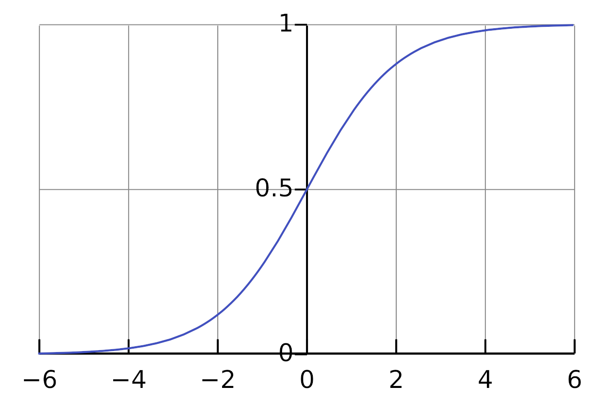

# Leveraging LLMs and Machine Learning for Record Matching

When currating data sets which relate to *entities*, whether these be products, people or corporations, we encounter a problem in knowning when one thing is the same as another. This process is variously known as record matching, record linking and entity resolution.

In *the real world*, determination of when two things are the same sometimes has a very definitive answer. Joe Bloggs may refer to more than one individual, but each of these individuals is unique and unambiguous. When there is a record it should be possible to assign to which of these Joe's they are referring, at least in principle. Sometimes however, the designation of an entity is more complicated and requires additional logic, for instance when a corporation has subsidiaries. In our discussion we are going to restrict ourselves to the former problem, where the real identity of something has a clear notion.

Record matching has been around for a very long time, and therefore has lots of well known approaches. But LLMs ([Large Language Models]([LLM](https://en.wikipedia.org/wiki/Large_language_model))) have enabled some new and surprisingly effective techniques that are often much more robust. Content which would have been difficult or even impossible to match on previously can now be utilised.

## Practical matching with LLMs

To demonstrate how LLMs can be leveraged for record matching we are going to use an LLM only solution. In practice, a mixture of approaches improves results, where semantically rich and textual content utilises the LLM and various quantitative, highly structure or temporal properties are matched with other approaches. Yet the pure LLM approach is so effective that for many use-cases we can ignore the more complex solution.

The general strategy is as follows:

- Obtain vector embeddings using fields from our records.
  - Fields can be individual or composite (e.g. first-middle-last name, full address) using a flexible templating approach
  - We vectorise one domain for matching ourselves, or two domains for cross-matching
- Obtain a small training set to help us discover a classifier.
- Choose a particular vectorised field or combination to obtain candidate records (also known as a filtering approach).
- Use the filter to find candidates and the classifier to obtain matches.

Not only does this approach make use of the advanced AI capacities of LLMs, it leverages AI to avoid the quadratic-explosion of possible combinations that is lurking in the matching problem if we have to compare each record against every other.

In this example, we're going to use the ACM / DBLP data-set which matches records across two databases of paper publications. This has the advantage of having a small known sample of exact matches which we can use to train. In many real world cases you will not have such a training set easily avaialble, but we'll discuss how you can obtain a similar dataset for your problem when we get to training.

## Preliminaries

To follow along with this tutorial you should download our [VectorLink](http://github.com/vectorlink-ai/) tool. This software requires [rust](https://www.rust-lang.org/) to build and a relatively modern Intel or AMD processor which contains the AVX2 instructions.

You should also download The ACM and DBLP datasets which can be found [here](http://github.com/terminusdb-labs/acm-dblp). The DBLP was translated from ISO-8859-1 encoded text to UTF-8 for simplicity.

## Vectorizing

Vectorisation is what we call the process of obtaining high-dimensional (embedding) vectors from (in this case) textual content, which encodes the semantic content. For this experiment we will use OpenAI's *small-3* and we will obtain the embeddings using thier API and an open-source rust tool we have built called VectorLink.

To use OpenAI you will first need to get an account at OpenAI and obtain an api-key.

Then you should create a config file called `config` with the following content:

```json
{ "model" : "openai-small3",
  "api_key" : "MY_API_KEY_HERE" }
```

First, we take the two CSV files and vectorize both, making sure to specify the field we would like to use as an identifier for the record. If you are using a CSV without an id field, you should add an additional column with a row count or some other unique identifier so you can recover the original record.

To specify the vectorised fields we need to supply a template directory which is filled with [handlebars templates](https://handlebarsjs.com/) that describe our fields. You can see the fields which correspond to our current use-case in the `templates` folder from the cloned dataset.

```
  -rw-rw-r-- 1 gavin gavin   20 Okt 14 10:49 authors.handlebars
  -rw-rw-r-- 1 gavin gavin   69 Okt 14 10:49 record.handlebars
  -rw-rw-r-- 1 gavin gavin   16 Okt 14 10:49 title.handlebars
  -rw-rw-r-- 1 gavin gavin   16 Okt 14 10:49 venue.handlebars
  -rw-rw-r-- 1 gavin gavin   14 Okt 14 10:49 year.handlebars
```

Each of these files will generate a field with a name that is the same as the file without the `.handlebars` which corresponds to our record and is stored in our output directory.

The handlebars templates are used to generate our embeddings by giving some context or combining fields from our records. For instance, the `record` field looks as follows:

```handlebars
Title: {{title}}
Authors: {{authors}}
Venue: {{venue}}
Year: {{year}}
```

This `record.handlebars` template will generate a composite of several fields, each of which carries a label of what it is meant to represent to help the LLM understand the semantic content.

```handlebars
Authors: {{authors}}
```

This `authors.handlebars` template specifies only one specific field, but again uses a label to ensure that the LLM knows what the content is supposed to be about.

Once these templates are specified we can go ahead and pass in the two CSVs (JSON-Lines files can also be processed). We do this by running the following command:


```shell
cargo run --release --bin generate-vectors csv-columns --config ~/acm-dblp/config -i ~/acm-dblp/DBLP2.utf8.csv -o ~/acm-dblp/dblp/ --template-dir ~/acm-dblp/templates --id-field "id"
```

And the second one...

```shell
cargo run --release --bin generate-vectors csv-columns --config ~/acm-dblp/config -i ~/acm-dblp/ACM.csv -o ~/acm-dblp/acm/ --template-dir ~/acm-dblp/templates --id-field "id"
```

This creates two *graphs* which hold information about which vectors correspond with which records and their chosen id. This will allow us to index specific fields to produce filters, and to create an aggregate measure over all, or a collection of, the fields.

## Indexing

The indexing phase is used to reduce the search space through a process called [*filtering*](https://arxiv.org/pdf/1905.06167). This filtering is obtained using an indexing approach for our vectors known as [HNSW](https://arxiv.org/abs/1603.09320). This index is based on approximate nearest neighbours ([ANN](https://en.wikipedia.org/wiki/Nearest_neighbor_search#Approximation_methods)) which allows one to quickly discover those vectors which are nearby with some probability.

This filtering process is important since matching M records to themselves, or M records to N other records naively is the product of the number of records (i.e. $`O(M^2)`$ or $`O(M N))`$, which gets big quickly. For a million records, this is already a trillion combinations - a number which is likely infeasible to calculate. Obviously most comparisons can be quickly exluded if we know something about the candidate records and that is why we use filtering. Now the process is more like $`O(N \log(N))`$ or $`O(M \log(N))`$. For a million this is more like $`C \times 1,000,000 \times 6`$, a number more managable than a trillion. And if we are looking for record matches of a dataset with itself, the number can be even smaller as we can use our ANN to find k approximate nearest neighbors extremely quickly.

In our case we are going to use the `record.handlebars` template's generated embeddings as our filter. That is, we will use the distance between whole records in our embedding space as the method to find candidate records. This field is called `record` due to the name of the template.

```shell
cargo run --release --bin index-graph-field -- --graph-directory ~/acm-dblp/acm --field record
```

## Learning a Classifier

Now that we have an indexed field we can proceed with the problem of learning a classifier. We use [logistic regression](https://en.wikipedia.org/wiki/Logistic_regression) as we have a two class problem. Essentially we have to say whether a record pair matches, or doesn't.

Since we have [multiple fields](https://en.wikipedia.org/wiki/Logistic_regression#Multiple_explanatory_variables), we want to learn a classifier which can learn weights for each feature which can be used to maximise our successful classification. We do this by using a linear combination of the distances with weights in a vector $`\vec{\beta}`$, and then applying a sigmoid ($`\sigma`$).



```math
y = \sigma( \vec{x} \cdot \vec{\beta} + \beta_{intercept} )
```

To simplify calculations, we add an additional dummy dimension to x which is always 1.0, so we can absorbe the beta_intercept and write:

```math
y = \sigma( \vec{x} \cdot \vec{\beta} )
```

Each dimension of the x vector is one of the fields we have vectorised. We can call the title dimension for instance $`x_{title}`$, which will have $`\beta_{title}`$ as a weight.

Since a sigmoid function is anti-symmetric and smooth around 0.5, we will call a prediction of the class a match if it is > 0.5 and a non-match if it is < 0.5.

At this point we need to learn the weights by searching through beta-space and finding a minimum of a cost function.

The cost function we choose is:

```math
cost = -[ y \ln(\sigma( \vec{x} \cdot \vec{\beta} )) + (1.0 - y) \ln((1 - \sigma( \vec{x} \cdot \vec{\beta}))) ]
```

What does this cost function calculate?

If we have a match, $`y`$ is 1.0 and the second term vanishes, if it is a non-match $`y`$ is 0.0 and the first term vanishes. Similarly we subtract from one in the second term to simply invert the meaning of the sigmoid for a non-match (changing a perfect prediction of a non match to a 1 and a match to 0).

We then take the cost to be the *order* of the sigmoid in the natural base, rather than the raw magnitude as is usually done for linear regression. The choice is essentialyl due to the non-linearity of the sigmoid. The choice allows us to penalise gracefully as we speed up towards 0.5 or slow down towards 0 or 1. The negative sign ensures that it is a *cost* we are minimising by forcing us to seek the least negative outcome.


At this point we take a gradient descent through beta-space according to this cost-function. Gradient descent attempts to follow the path of least resistance to find a minimum. In the actual programme all of this search is handled with the rust library [argmin](https://docs.rs/argmin/latest/argmin/).

The process relies on the file [DBLP-ACM_perfectMapping.csv](./DBLP-ACM_perfectMapping.csv) which has a list of all correct matches. The process requires that we have an exhaustive list of the matches as everything not contained in the list is deemed to be a non-match and will influence the above cost function my choosing $`y = 0`$.

Later, we will return to the question of how to create such a set of perfect matches to learn weights for actual match problems where one often does not have such a curated training set available.

In order to begin learning the weights, we simply invoke the `find-weights` sub-command. We choose an initial-threshold of 0.3 which reduces the search space to candidates which are with 0.3 distance. This can be *choked* further if too many candidates are being tested, but for us this provides a nice wide window to ensure we get almost everything of interest and the calculation is fast.

```shell
cargo run --release --bin generate-vectors -- find-weights --config ~/tmp/dblp/config -s ~/tmp/dblp -t ~/tmp/acm -f "record" --initial-threshold 0.3 --answers-file ~/dev/acm-dblp/DBLP-ACM_perfectMapping.csv --comparison-fields "title" "authors" "venue" "year"
```

We find the following weights:

```json
{ "year":          -9.939934,
  "title":        -25.451017,
  "__INTERCEPT__":  3.1453862,
  "authors":      -21.432272,
  "venue":         -1.2297093 }
```

We see here that $`\beta_{intercept}`$ is writen as `"__INTERCEPT__"` and does not correspond to any of the fields. This intercept is used to help us balance the sigmoid nicely around the classification point of 0.5.

In addition to the weight calculation, we also get an assessment of the quality of the weights in predicting our class. Internally, the perfect match file is broken into two pieces: one which is used to train (about 1/3 of the file) and the remainder for the evaluation of the match quality.

To obtain a measure of the match quality we use a technique known as [ROC AUC (Receiver Operating Characteristic Area Under the Curve)](https://en.wikipedia.org/wiki/Receiver_operating_characteristic). This measure is closely related to the concepts of recall and precision in document retrieval, as it measures the true-positive rate versus false-positive rate.

## Matching

With weights in hand we can fire off the process of generating a match file. This will simply apply the classifier to our candidate matches and we will save all of the matches above threshold into a CSV file, including the actual value of the sigmoid so we have an idea of the confidence of the prediction. The matches use the id field so that the original records can be recovered from the information given for the match in the CSV.

We open the filter to 0.4 (this is a number between 0 and 1 giving the distance, with 0 being smallest as we are using a cosine measure) to ensure that we are getting even very weak candidate matches for our final search. We choose a match threshold of 0.55, so we are effectively trimming out some low confidence matches. Depending on application one may want to either lower or raise this threshold.

```
cargo run --release --bin generate-vectors -- compare -s ~/acm-dblp/dblp -t ~/acm-dblp/acm --id-field "id" -f "record" --initial-threshold 0.4 -m 0.55 -c ~/acm-dblp/config -o ~/acm-dblp/matches.csv -w '{ "year": -9.939934, "title": -25.451017, "__INTERCEPT__":  3.1453862, "authors": -21.432272, "venue": -1.2297093 }'
```

Congratulations! You now have the list of matches. To evaluate the quality of the matches you can use the `recall.py` which will compare to the exact matches.

## Conclusion

We have gone through the basic process of learning a match classifier on records with a very flexible approach which leverages AI to obtain high quality record matches. We require only a CSV or JSON lines file and match candidates to learn weights.

There are two major things missing from the approach outlined, the first is how to obtain the correct matches, and the second is how to make this process scale to larger solutions. We will answer both of these questions in further articles.

